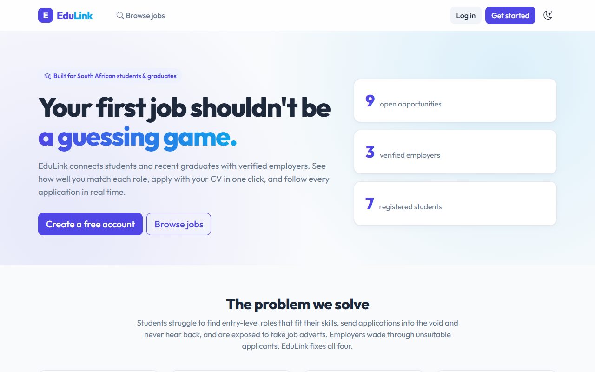
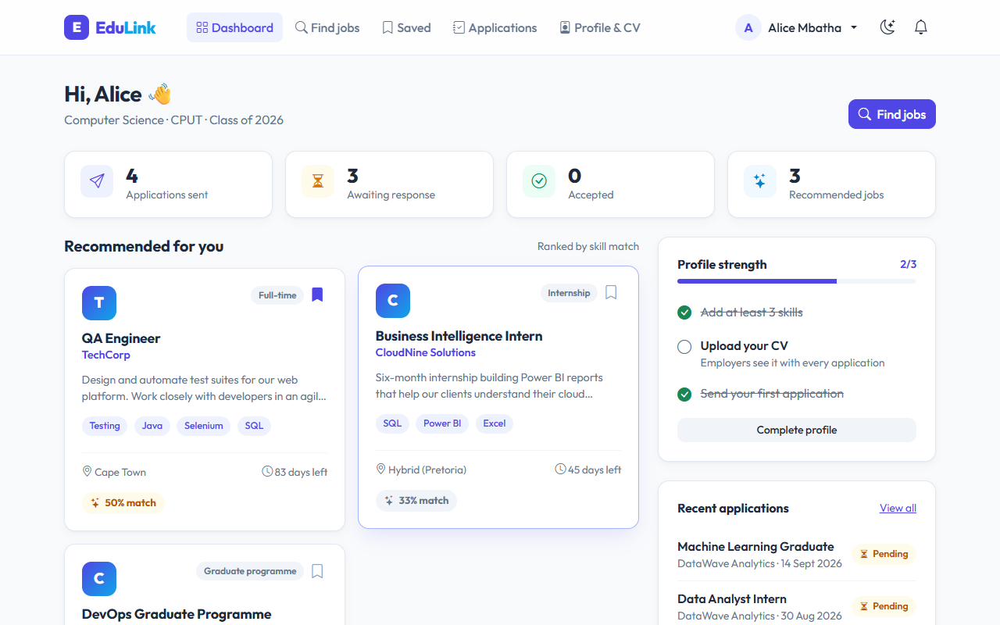
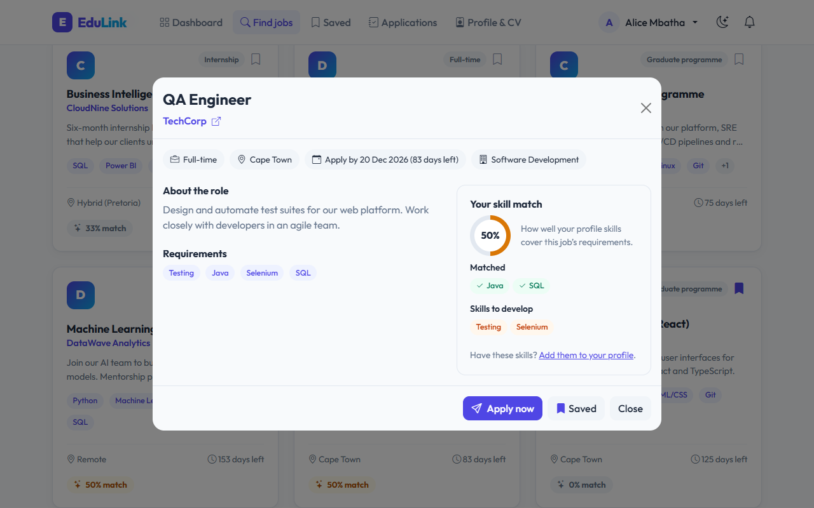
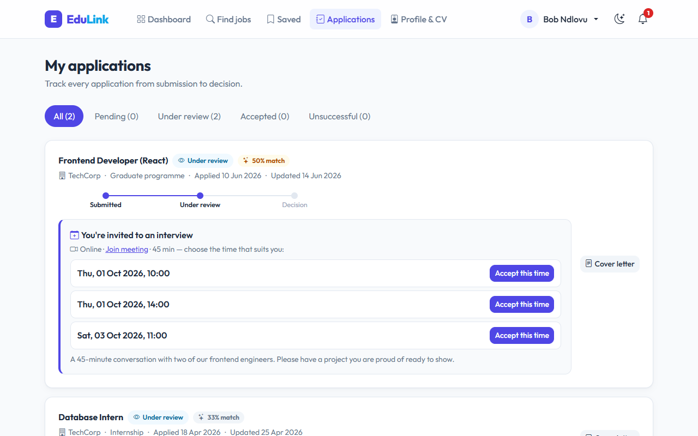
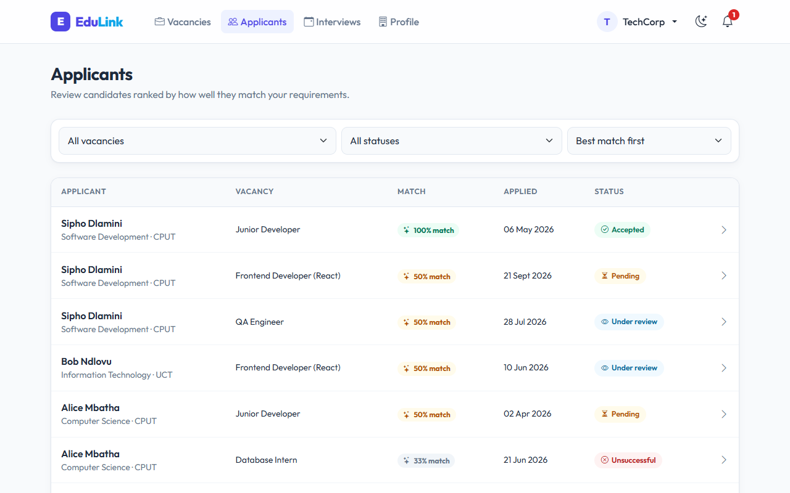
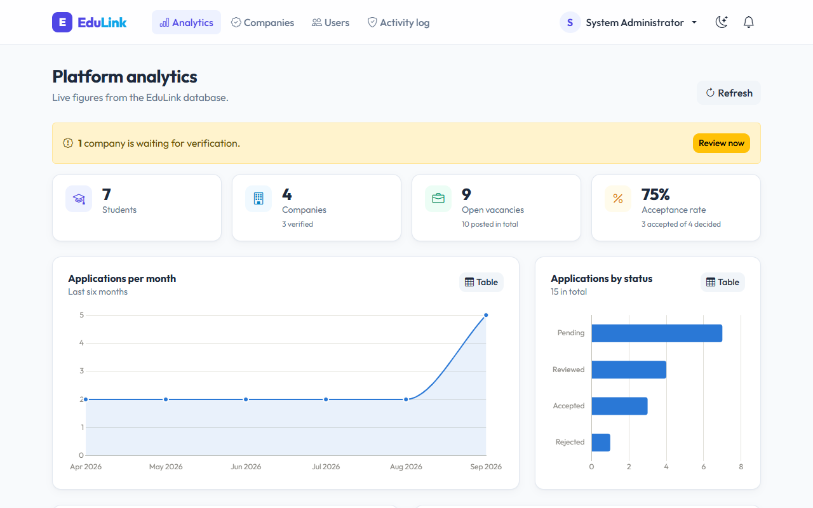
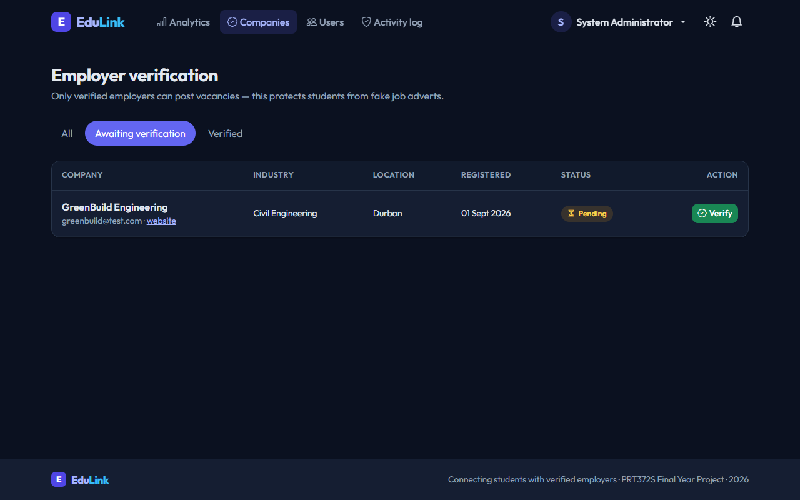
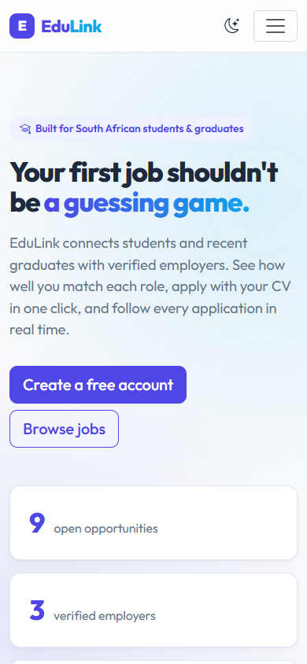
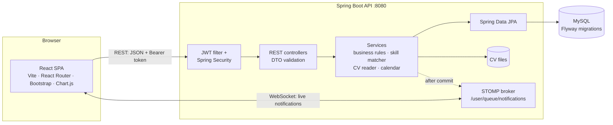
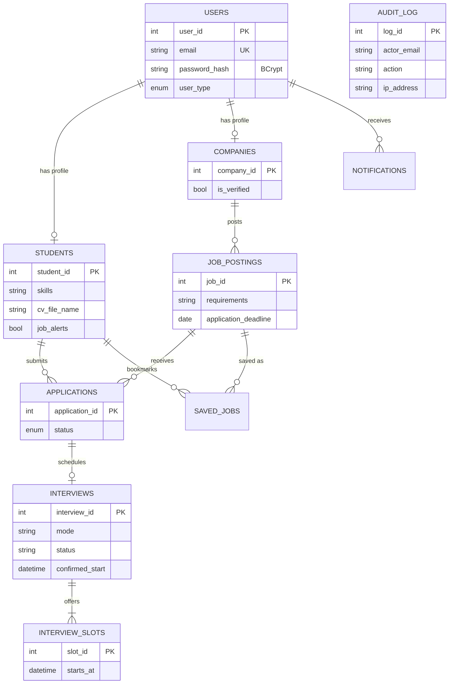

<p align="center">
  <picture>
    <source media="(prefers-color-scheme: dark)" srcset="docs/assets/edulink-logo-dark.svg">
    
  </picture>
</p>

<p align="center">
  <strong>Your first job shouldn't be a guessing game.</strong><br>
  A secure, real-time career portal that connects students and recent graduates with <em>verified</em> employers, using skill-based job matching.
</p>

<p align="center">
  <!-- After pushing to GitHub, replace YOUR-GITHUB-USERNAME with the account/organisation that owns the repo -->
  <a href="https://github.com/YOUR-GITHUB-USERNAME/EduLink-PRT362S/actions/workflows/ci.yml"></a>
  
  
  
  
  
</p>

<p align="center"><em>PRT362S / PRT372S Final Year Project</em></p>

<p align="center">
  
</p>

---

## Contents

1. [What is EduLink?](#what-is-edulink)
2. [The problem it solves](#the-problem-it-solves)
3. [Who it is for](#who-it-is-for)
4. [Features](#features)
5. [Screenshots](#screenshots)
6. [Tech stack](#tech-stack)
7. [**Run it on your own machine**](#run-it-on-your-own-machine) (IntelliJ + VS Code + XAMPP or MySQL Workbench)
8. [Demo accounts](#demo-accounts)
9. [The database: demo data & useful SQL queries](#the-database-demo-data--useful-sql-queries)
10. [The admin portal](#the-admin-portal)
11. [Troubleshooting](#troubleshooting)
12. [Security](#security) · [Architecture](#architecture) · [API](#api-overview) · [Testing](#testing) · [Project structure](#project-structure)
13. [Team](#team)

---

## What is EduLink?

EduLink is a web platform where **students and recent graduates** find internships, graduate programmes and entry-level jobs, **employers** find suitable candidates, and a **university career office (administrator)** keeps the platform safe.

What makes it different from a plain job board:

- every vacancy shows **how well you match it**, and which skills you still need
- students **upload a CV and EduLink reads it**, suggesting skills to add to their profile
- only employers **verified by an administrator** can post jobs, which blocks fake adverts
- every application has a **live status**, and interviews are **booked inside the platform**, with a calendar invite

It has three portals in one system: **Student**, **Employer** and **Admin**.

## The problem it solves

Looking for a first job is hard, and the usual tools make it harder.

| # | The problem | How EduLink solves it |
|---|---|---|
| 1 | **Students can't tell which jobs they qualify for.** They apply everywhere, or talk themselves out of roles they would be good at. | A **match percentage** on every job, a list of matched and missing skills, and **recommendations** ranked by match. |
| 2 | **Applications disappear into a void.** Most students never hear back and don't know where they stand. | A **status timeline** on every application (Submitted → Under review → Decision), with **instant notifications** when anything changes. |
| 3 | **Fake job adverts target graduates.** Scam "employers" collect personal information or ask for "admin fees". | Companies must be **verified by an administrator** before they can post. Every admin action is recorded. |
| 4 | **Employers are flooded with unsuitable applicants,** and arranging interviews means endless emails. | Applicants **ranked by skill match**. Interviews are **scheduled in the app**: the employer offers times, the student picks one, and both get a calendar invite. |

## Who it is for

| Audience | What they need | What EduLink gives them |
|---|---|---|
| **Students & recent graduates** (e.g. CPUT, UCT, Wits, UJ, TUT) | Relevant opportunities and honest feedback | Match scores, recommendations, CV skill suggestions, saved jobs, job alerts, live application tracking, one-click interview booking |
| **Employers** (small businesses to large companies) hiring interns and graduates | Qualified applicants, quickly | Vacancy management, applicants ranked by match, CV viewing, interview scheduling with calendar invites |
| **Administrators** (e.g. a university career office) | A trustworthy, well-run platform | Employer verification, account management, analytics dashboard, security activity log |

## Features

### Student portal
- **Skill-match scoring.** Every job shows a % match between your skills and its requirements, plus the exact skills you are missing.
- **Skills from your CV.** Upload a PDF; EduLink reads it and suggests the skills it finds. "Add all" in one click.
- **Recommendations and job alerts.** Open jobs are ranked by match. You are notified when a new job matches at least 60% of your skills (you can switch this off).
- **Search, filter, sort and save** jobs.
- **Live application tracking.** A Submitted → Under review → Decision timeline that updates without refreshing.
- **Interview booking.** Pick one of the employer's proposed times, then add it to Google Calendar or Outlook (`.ics` file).

### Employer portal
- **Post, edit, close and re-open vacancies** (after admin verification).
- **Applicants ranked by best match**, with matched and missing skills, the cover letter and the CV.
- **Interview scheduling.** Propose up to three times (online, in person or phone), and see the candidate's choice live.
- **Accept, decline or mark under review.** The student is notified in real time.

### Admin portal
- **Analytics dashboard.** Applications per month, applications by status, vacancies by type, top employers and acceptance rate. Every chart also has a table view.
- **Employer verification.** Approve or revoke companies.
- **User management.** Find users by email or role and deactivate or reactivate accounts. A deactivated user is locked out immediately.
- **Activity log.** Logins, failed logins, account lockouts and every admin action, with time and IP address.

### Everywhere
- **Real-time notifications** (WebSockets): the bell, pop-up toasts and self-updating pages.
- **Dark mode**, following your system setting or the toggle in the navbar.
- **Responsive** on phone, tablet and desktop, with keyboard and screen-reader support.

## Screenshots

| Student dashboard: recommendations ranked by match | Job details with the skill-match breakdown |
|---|---|
|  |  |
| **Interview invitation: the student picks a time** | **Employer: applicants ranked by best match** |
|  |  |
| **Admin analytics dashboard** | **Admin employer verification (dark mode)** |
|  |  |

<p align="center"><br><em>Works on phones too.</em></p>

## Tech stack

| Layer | Technology |
|---|---|
| Frontend | React 18, Vite 5, React Router 6, React-Bootstrap / Bootstrap 5.3 (light and dark), Chart.js, Axios, STOMP.js |
| Backend | Java 21 (LTS, also runs on 25), Spring Boot 3.5 (Web, WebSocket, Data JPA, Security, Validation) |
| Authentication | JWT (jjwt 0.12), BCrypt password hashing |
| Documents | Apache PDFBox (reads CVs), iCalendar `.ics` generation |
| Database | MySQL 8 or MariaDB (XAMPP); schema versioned with **Flyway** migrations (V1–V6) |
| API docs | springdoc-openapi / **Swagger UI** |
| Testing | JUnit 5, Mockito, Spring MockMvc + H2 (backend); Vitest (frontend) |
| DevOps | **Docker Compose** (MySQL + API + nginx), **GitHub Actions** CI |

---

## Run it on your own machine

You run three things: **the database** (XAMPP *or* MySQL Workbench), **the backend** (IntelliJ IDEA), and **the frontend** (VS Code).

```
 Browser  ──►  Frontend (VS Code)  ──►  Backend (IntelliJ)  ──►  MySQL database
 :5173         React + Vite             Spring Boot :8080         XAMPP or MySQL Server :3306
```

### What you need to install

| Tool | Version | Download |
|---|---|---|
| **JDK** | 21 or newer (21 and 25 both work) | [Eclipse Temurin](https://adoptium.net/temurin/releases/?version=21) |
| **IntelliJ IDEA** | 2025.1 or newer | [jetbrains.com/idea](https://www.jetbrains.com/idea/download/) |
| **Node.js** | 20 or newer (LTS) | [nodejs.org](https://nodejs.org/) |
| **VS Code** | any recent | [code.visualstudio.com](https://code.visualstudio.com/) |
| **Database: choose ONE** | | |
| ↳ XAMPP (easiest) | any recent | [apachefriends.org](https://www.apachefriends.org/) |
| ↳ MySQL Server + Workbench | 8.x | [MySQL Installer](https://dev.mysql.com/downloads/installer/) (installs both) |
| **Git** (optional) | any | [git-scm.com](https://git-scm.com/) |

Maven does **not** need to be installed: IntelliJ has it built in.

### Step 1: Get the code

```bash
git clone https://github.com/YOUR-GITHUB-USERNAME/EduLink-PRT362S.git
```
or click **Code → Download ZIP** on GitHub and unzip it.

### Step 2: Start the database

You do **not** need to create any tables yourself. The backend creates the `edulink_db` database, every table and the demo data automatically the first time it starts. You only need the MySQL server running.

<details open>
<summary><strong>Option A: XAMPP</strong></summary>

1. Open the **XAMPP Control Panel**.
2. Click **Start** next to **MySQL** (and next to **Apache** if you want phpMyAdmin).
3. That's it. XAMPP's MySQL user is `root` with **no password**, which is what EduLink expects by default.

To look at the data later, open <http://localhost/phpmyadmin> and select **edulink_db**.
</details>

<details open>
<summary><strong>Option B: MySQL Server + MySQL Workbench</strong></summary>

1. Install **MySQL Server 8** and **MySQL Workbench** (the MySQL Installer does both). Remember the **root password** you choose.
2. Make sure the MySQL service is running (Windows: *Services* → **MySQL80** → Running).
3. Open **Workbench** and connect to *Local instance MySQL80* (`root@localhost:3306`).
4. Because your root user has a password, tell EduLink what it is (see Step 3, point 4).

Optional: you can create the empty database yourself in Workbench with `CREATE DATABASE edulink_db;`. The backend creates the tables inside it.
</details>

> **Important:** use only one database server at a time. If both XAMPP MySQL and MySQL80 are running they fight over port 3306. Stop one of them.

### Step 3: Run the backend in IntelliJ IDEA

1. **File → Open…** and select the **`backend`** folder (not the root folder). Choose **Trust Project**.
2. **File → Project Structure → Project**: set **SDK** to **21** or newer (if it isn't listed: *Add SDK → JDK…* and pick your JDK folder, e.g. `C:\Program Files\Java\jdk-21`). Set **Language level** to *SDK default*.
3. Open the **Maven** tool window (right-hand side) and click **Reload All Maven Projects** (🔄). Wait for the downloads to finish; this happens once.
4. **Only if your MySQL root user has a password** (MySQL Workbench users):
   **Run → Edit Configurations… → EduLinkApplication → Environment variables** and add
   `DB_PASSWORD=your-mysql-root-password`
   (you can also set `DB_USERNAME` if you don't use `root`).
5. Open `src/main/java/za/ac/mycput/EduLinkApplication.java` and click the green ▶ **Run** button next to `main`.
6. Wait for this line in the console:
   ```
   Tomcat started on port 8080 (http)
   Started EduLinkApplication in … seconds
   ```

The backend is now running at <http://localhost:8080>. Try:
- <http://localhost:8080/api/jobs>: the job list as JSON
- <http://localhost:8080/swagger-ui.html>: interactive API documentation

On the **first start**, Flyway creates `edulink_db`, all tables and the core demo accounts. Every later start only applies new migrations, and your data is kept.

### Step 4: Run the frontend in VS Code

1. **File → Open Folder…** and select the **`frontend`** folder.
2. Open a terminal: **Terminal → New Terminal** (Ctrl + `).
3. Install the packages (first time only, takes about a minute):
   ```bash
   npm install
   ```
4. Start the development server:
   ```bash
   npm run dev
   ```
5. Open **<http://localhost:5173>** in your browser.

Keep both the IntelliJ backend and the VS Code terminal running while you use the system. The frontend forwards all `/api` and `/ws` (live notifications) requests to the backend on port 8080.

### Step 5 (optional): Load the full demo data set

The first start already gives you 9 demo accounts, 8 vacancies and 12 applications. For a richer demo (2 extra students, an extra employer, interviews, saved jobs and notifications), run **[`database/demo_data.sql`](database/demo_data.sql)**:

- **XAMPP:** <http://localhost/phpmyadmin> → click **edulink_db** → **SQL** tab → paste the whole file → **Go**.
- **MySQL Workbench:** **File → Open SQL Script…** → `database/demo_data.sql` → click the ⚡ **Execute** button.

It is safe to run more than once: nothing is duplicated and nobody's changed password is overwritten. The last result shows how many rows each table has.

### Alternative: Docker (one command)

If you have [Docker Desktop](https://www.docker.com/products/docker-desktop/), you can skip Steps 2–4:

```bash
docker compose up --build
```

Then open **<http://localhost:3000>**. MySQL, the backend and the frontend all start in containers, with the demo data. To change the default passwords, copy `.env.example` to `.env`.

---

## Demo accounts

| Role | Email | Password | What to try |
|---|---|---|---|
| **Admin** | `admin@edulink.com` | `admin123` | Analytics, verify GreenBuild, manage users, activity log |
| Student | `alice.student@test.com` | `password123` | Recommendations, match scores, applications |
| Student | `bob.student@test.com` | `password123` | Has an interview invitation waiting* |
| Student | `thandi.student@test.com` | `password123` | Data-science profile, an accepted application |
| Student | `sipho.student@test.com` | `password123` | A confirmed upcoming interview* |
| Student | `lerato.student@test.com` | `password123` | Cloud and networking profile |
| Student | `naledi.student@test.com` | `password123` | Business-intelligence profile* |
| Student | `kagiso.student@test.com` | `password123` | DevOps profile* |
| Employer | `techcompany@test.com` | `password123` | **TechCorp**: verified, most vacancies and applicants |
| Employer | `datawave@test.com` | `password123` | **DataWave Analytics**: verified |
| Employer | `cloudnine@test.com` | `password123` | **CloudNine Solutions**: verified* |
| Employer | `greenbuild@test.com` | `password123` | **GreenBuild Engineering**: **not verified**, so it cannot post until an admin approves it |

\* Added or completed by [`database/demo_data.sql`](database/demo_data.sql) (Step 5).

The login page also has one-click **Student / Company / Admin** buttons that fill these in.

You can also **register your own** student or employer account from the *Get started* page. New employers must be verified by the admin before they can post vacancies.

---

## The database: demo data & useful SQL queries

The [`database/`](database) folder contains three scripts. Open them in phpMyAdmin (XAMPP) or MySQL Workbench.

| File | What it is for |
|---|---|
| [`demo_data.sql`](database/demo_data.sql) | Fills the database with demo users (students, employers, admin), vacancies, applications, interviews, saved jobs and notifications. Safe to run repeatedly. |
| [`queries.sql`](database/queries.sql) | Ready-made queries: **reports** (applications per company, open vacancies, acceptance rates, upcoming interviews), **admin tasks** (verify a company, deactivate a user, create another admin, reset a password, read the activity log) and **maintenance**. |
| [`schema.sql`](database/schema.sql) | A readable copy of every table, for documentation and **ER diagrams** (Workbench → *Database → Reverse Engineer*). It creates a separate `edulink_schema_reference` database, so it never touches your real data. |

### A few examples

**All applications, with student, job and company:**
```sql
SELECT a.application_id, s.full_name, j.title, c.company_name, a.status, a.applied_date
FROM applications a
JOIN students s     ON a.student_id = s.student_id
JOIN job_postings j ON a.job_id = j.job_id
JOIN companies c    ON j.company_id = c.company_id
ORDER BY a.applied_date DESC;
```

**Every user with their role:**
```sql
SELECT u.email, u.user_type, u.is_active,
       COALESCE(s.full_name, c.company_name, 'Administrator') AS display_name
FROM users u
LEFT JOIN students s  ON u.user_id = s.user_id
LEFT JOIN companies c ON u.user_id = c.user_id;
```

**Approve a company (same as the admin portal's Verify button):**
```sql
UPDATE companies SET is_verified = TRUE
WHERE user_id = (SELECT user_id FROM users WHERE email = 'greenbuild@test.com');
```

**Create another administrator** (password `admin123`):
```sql
INSERT INTO users (email, password_hash, user_type, is_active)
VALUES ('careers.office@edulink.com',
        '$2a$10$0B.lxOqgb9Bk3k/8gihczOD0Mo9oQ7qCoyTRvtWM9GTgtUUDmB6he', 'admin', TRUE);
```

> **Why the long password strings?** EduLink never stores passwords as plain text. They are stored as **BCrypt hashes**, so typing `password123` straight into the `password_hash` column will *not* let anyone log in. The scripts use the hashes of the demo passwords; `queries.sql` also shows how to reset a password.

### Starting again from scratch

1. Stop the backend.
2. Run `DROP DATABASE edulink_db;`
3. Start the backend again. Flyway rebuilds every table and the core demo data; run `demo_data.sql` for the rest.

### How the database is managed

The tables are created by **Flyway migrations** in [`backend/src/main/resources/db/migration`](backend/src/main/resources/db/migration). Each file runs once, in order, and is recorded in the `flyway_schema_history` table:

| Migration | What it does |
|---|---|
| V1 | Original tables: users, students, companies, job_postings, applications |
| V2 | CV upload fields, notifications, indexes |
| V3 | Core demo data |
| V4 | Hashes any plain-text passwords with BCrypt (Java migration) |
| V5 | Interviews, interview slots, saved jobs, job-alert setting, activity log |
| V6 | Makes the activity log independent of live user rows |

---

## The admin portal

Yes, EduLink has a full administrator portal. Log in as **`admin@edulink.com` / `admin123`** and the menu shows:

| Page | What the admin can do |
|---|---|
| **Analytics** | Totals (students, employers, open vacancies, acceptance rate) and charts: applications per month, by status, vacancies by type, top employers. A yellow banner shows employers waiting for approval. |
| **Companies** | **Verify** new employers (only verified employers can post), or **revoke** verification. The employer is notified instantly. |
| **Users** | Find users by email and filter by role; **deactivate** an account (the user is locked out immediately, even mid-session) or reactivate it. |
| **Activity log** | Filterable record of logins, failed logins, account lockouts, registrations, password changes and every admin action, with time and IP address. |
| **Vacancies** (API) | An admin can delete any vacancy that breaks the rules with `DELETE /api/jobs/{id}` (e.g. from Swagger UI). The deletion is recorded in the activity log. There is no button for this in the admin pages yet. |

Try it: log in as admin, open **Companies**, and verify **GreenBuild Engineering**. Then log in as `greenbuild@test.com` and it can now post vacancies.

---

## Troubleshooting

| Problem | Fix |
|---|---|
| IntelliJ: **"JDK isn't specified for module"**, **"release version 5 not supported"** or **"release version 21 not supported"** | **File → Project Structure → Project → SDK = 21** (or newer), then reload Maven (🔄 in the Maven tool window). |
| Backend: **`Access denied for user 'root'@'localhost'`** | Your MySQL root user has a password. Add `DB_PASSWORD=…` to the run configuration's environment variables (Step 3, point 4). |
| Backend: **`Communications link failure`** | MySQL isn't running. Start it in XAMPP, or start the **MySQL80** Windows service. |
| Backend: **`Port 8080 was already in use`** | Another copy of the backend is still running. Stop it (red ■ in IntelliJ) or restart IntelliJ. |
| Website: **"Cannot reach the EduLink server"** | The backend isn't running, or hasn't finished starting. Wait for `Started EduLinkApplication`. |
| Login: **"Too many failed login attempts"** | 5 wrong passwords lock that email for 15 minutes (a security feature). Wait, or restart the backend to clear it. |
| VS Code: **`npm` is not recognized** | Install Node.js, then close and reopen VS Code. |
| Workbench: **Error 1175 (safe update mode)** on an `UPDATE` | Use the queries as written in `queries.sql` (they filter by a key column), or turn it off in *Edit → Preferences → SQL Editor*. |
| Characters such as "—" show as `ÔÇö` after running a script | Run the scripts in phpMyAdmin or Workbench, or from the command line with `--default-character-set=utf8mb4`. |
| Both XAMPP MySQL and MySQL80 are installed | Only one can use port 3306. Stop the one you are not using. |

---

## Security

Security was a major focus of version 2. See [`docs/SYSTEM_AUDIT.md`](docs/SYSTEM_AUDIT.md) for the full audit.

| Threat | Protection |
|---|---|
| Stolen passwords | **BCrypt** password hashing. Existing plain-text passwords were migrated automatically. |
| Impersonation / fake sessions | **JWT** authentication (HMAC-SHA256 signed, 8-hour expiry). The user is re-checked against the database on every request, including when a WebSocket connects. |
| Privilege escalation | **Role-based access control** (`STUDENT`, `COMPANY`, `ADMIN`), enforced before input is even read. |
| Acting on other users' data (IDOR) | The acting user always comes from the token. Ownership is checked on every job, application, CV and interview. |
| Brute-force login | Lock after **5 failed attempts for 15 minutes**. Timing-safe responses. Every attempt goes to the activity log. |
| Eavesdropping on live updates | WebSocket clients must authenticate, and can only subscribe to their own notification queue. |
| Cross-site scripting (XSS) | React escapes all output. User-supplied URLs are restricted to `http(s)`. |
| Malicious uploads | Real PDF signature check, random UUID file names, path-traversal protection, 5 MB limit. |
| Bad input | **Bean Validation** on every request, with field-level error messages. |
| Information leakage | A global exception handler never exposes stack traces or SQL. |
| Cross-origin abuse | CORS and WebSocket origins restricted to the frontend. |
| Accountability | An activity log (audit trail) of security events and admin actions. |

## Architecture



**Layered backend:** Controller → Service (interface + implementation) → Repository → Entity, with DTOs at the API boundary.

**Design patterns:** Builder (entities) · Repository · DTO · Observer (notifications are published as events and pushed to browsers only after the transaction commits) · Chain of Responsibility (security filter chain) · Front Controller (Spring MVC).

### Data model



The `AUDIT_LOG` table is deliberately **not** linked to `USERS` with a foreign key: a history record must survive user deletion and must never block the action it records.

## API overview

Full interactive documentation: **<http://localhost:8080/swagger-ui.html>**.

| Area | Endpoints |
|---|---|
| Auth | `POST /api/auth/login` · `POST /api/auth/register/{student,company}` · `GET /api/auth/me` · `PUT /api/auth/password` |
| Jobs | `GET /api/jobs?q=&type=&sort=&page=` · `GET /api/jobs/{id}` · `POST /api/jobs` · `PUT /api/jobs/{id}` · `PATCH /api/jobs/{id}/status` · `DELETE /api/jobs/{id}` |
| Student | `GET/PUT /api/students/me` · `…/applications` · `…/recommendations` · `…/interviews` · `POST/GET/DELETE …/cv` · `GET …/cv/skills` · `GET …/saved-jobs` · `PUT/DELETE …/saved-jobs/{jobId}` |
| Company | `GET/PUT /api/companies/me` · `…/jobs` · `…/applications?status=&jobId=` · `…/interviews` |
| Applications | `POST /api/applications` · `DELETE /api/applications/{id}` · `PATCH /api/applications/{id}/status` · `GET /api/applications/{id}/cv` |
| Interviews | `POST /api/applications/{id}/interview` · `POST /api/interviews/{id}/confirm` · `POST /api/interviews/{id}/cancel` · `GET /api/interviews/{id}/calendar` |
| Notifications | `GET /api/notifications` · `PATCH /api/notifications/{id}/read` · `POST /api/notifications/read-all` · WebSocket `/ws` → `/user/queue/notifications` |
| Admin | `GET /api/admin/stats` · `GET /api/admin/users` · `PATCH /api/admin/users/{id}/status` · `GET /api/admin/companies` · `PATCH /api/admin/companies/{id}/verification` · `GET /api/admin/activity` |
| Public | `GET /api/public/stats` |

All errors share one JSON shape:
```json
{ "timestamp": "…", "status": 400, "error": "Bad Request",
  "message": "Please correct the highlighted fields.", "path": "/api/auth/register/student",
  "fieldErrors": { "password": "Password must be 8-100 characters and contain at least one letter and one number" } }
```

## Testing

```bash
cd backend && mvn test      # 48 tests. Or in IntelliJ: right-click src/test/java → Run 'All Tests'
cd frontend && npm test     # 8 tests
```

The tests use an in-memory H2 database, so they never touch your MySQL data. Every push to GitHub runs all tests and builds the Docker images automatically ([`.github/workflows/ci.yml`](.github/workflows/ci.yml)).

- **`SecurityIntegrationTest`** replays attacks through the real HTTP layer: forged tokens, a student calling admin endpoints, one company changing another's applicants, withdrawing someone else's application, an unverified company posting, duplicate applications, a disabled user reusing their token.
- **`FeatureIntegrationTest`** covers the interview lifecycle, saved jobs, job alerts, the activity log with the 5-failure lockout, and the analytics numbers.
- **`AccountIntegrationTest`** covers student and employer registration and password changes.
- **Unit tests** cover skill matching, CV skill extraction (from a real generated PDF), `.ics` generation, JWT tampering and expiry, the lockout timer, WebSocket authentication, and the activity log's failure handling.

## Project structure

```
EduLink/
├── backend/                     Spring Boot API (Dockerfile inside)
│   └── src/main/java/za/ac/mycput/
│       ├── config/              Swagger/OpenAPI, WebSocket (STOMP)
│       ├── controller/          REST endpoints (thin: validation + delegation)
│       ├── domain/              JPA entities (Builder pattern) + enums
│       ├── dto/                 Request/response records with validation rules
│       ├── exception/           ApiException + global error handler
│       ├── repository/          Spring Data JPA repositories
│       ├── security/            JWT, security filter chain, WebSocket auth, login lockout
│       └── service/             Business logic (interfaces + impl), SkillMatcher, SkillExtractor, IcsCalendar
│   └── src/main/resources/
│       ├── application.properties   Database connection, JWT, CORS, upload settings
│       ├── db/migration/        Flyway migrations V1–V6 (+ V4 in java/db/migration)
│       └── skills/              Skill dictionary used to read CVs (editable text file)
├── frontend/                    React single-page app (Dockerfile + nginx.conf inside)
│   └── src/
│       ├── api/                 Axios client, endpoint functions, live WebSocket client
│       ├── components/          Navbar, notifications, job cards, interview widgets, shared UI
│       ├── context/             Auth, theme (dark mode), toast and confirm-dialog providers
│       ├── pages/               student/, company/, admin/ + public pages
│       └── utils/               Formatting & security helpers (unit tested)
├── database/                    demo_data.sql · queries.sql · schema.sql
├── docs/
│   ├── assets/                  EduLink logo (SVG + PNG, light and dark) and app icon
│   ├── screenshots/             Images used in this README
│   ├── SYSTEM_AUDIT.md          What was wrong with version 1 and how it was fixed
│   ├── CHANGELOG.md             Every change, by release
│   └── DEMO_SCRIPT.md           A 12-minute walkthrough for the final presentation
├── docker-compose.yml           Whole system with one command
└── .github/workflows/ci.yml     Continuous integration
```

### The EduLink logo

The logo files are in [`docs/assets/`](docs/assets): the full logo in light and dark versions (`edulink-logo.svg`, `edulink-logo-dark.svg`, plus PNG copies) and the square app icon (`edulink-icon.svg`, `edulink-icon-512.png`). Use them in presentations and reports.

Brand colours: indigo `#4f46e5` ("Edu" and the icon) and sky blue `#0ea5e9` ("Link"). The font is [Outfit](https://fonts.google.com/specimen/Outfit), ExtraBold.

## Team

| Member | Role |
|---|---|
| Ahmad Zia Hasan Modarrisi | Backend Developer & Chairperson |
| Mogamad Jawaad Allie | Frontend Developer & Technical Lead |
| Asisipho Mlahlwa | System Analyst & Secretary |
| Sinethemba Mkhoma | QA Engineer & Mediator |
